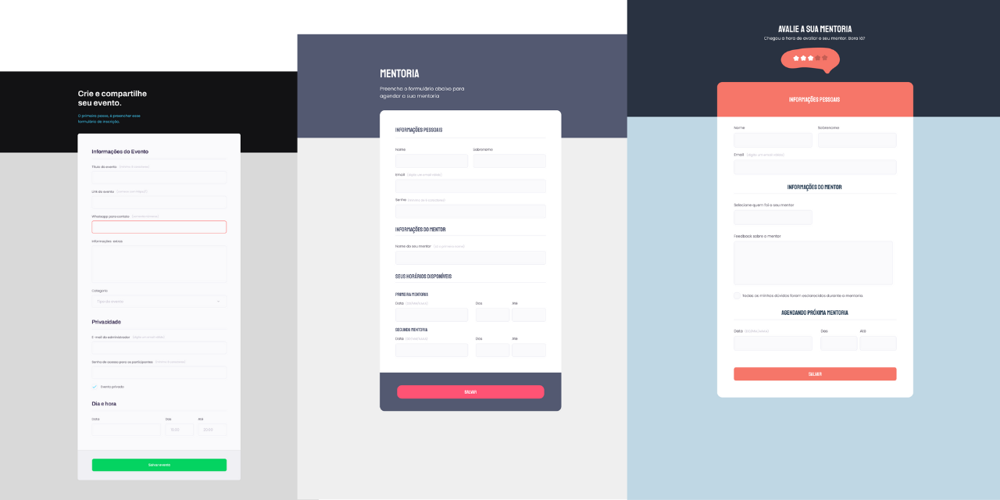

# Formulários
Formulário nível iniciante (acrescentado responsividade) para mobile, telas médias, grandes e TV's.  
Beginner-level form (added responsiveness) for mobile, medium and large screens and TVs.   
Formulário nível intermediário (acrescentado responsividade) para mobile, telas médias, grandes e TV's.  
Intermediate-level form (added responsiveness) for mobile, medium and large screens and TVs.   
Formulário nível avançado (acrescentado responsividade) para mobile, telas médias, grandes e TV's.  
Advanced-level form (added responsiveness) for mobile, medium and large screens and TVs.  

## 💻 Projetos Iniciante | Intermediário | Avançado
